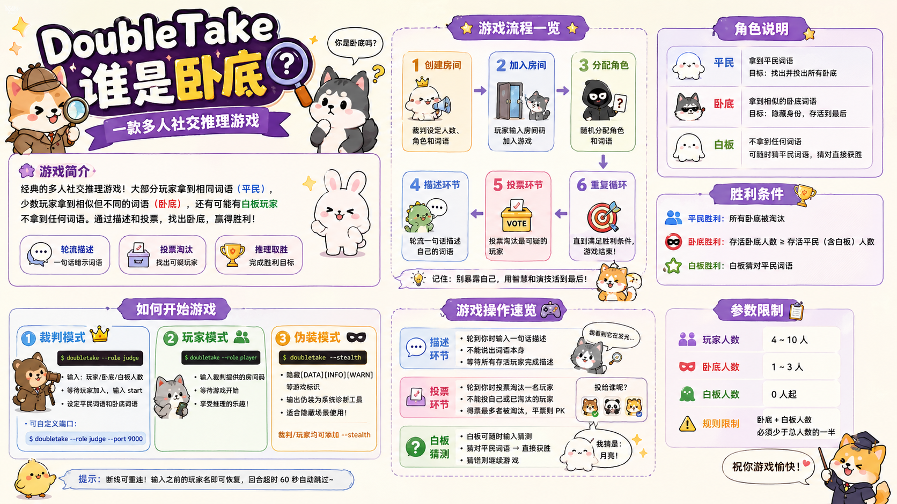
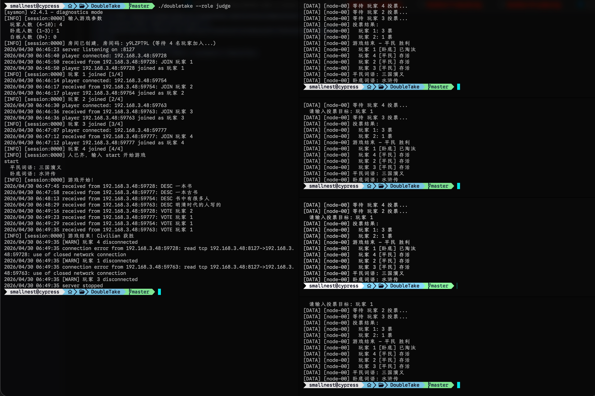

# DoubleTake — 谁是卧底

## 简介

**谁是卧底** 是一款经典的多人社交推理游戏。每位玩家会获得一个词语，其中大部分玩家（平民）拿到相同的词语，少数玩家（卧底）拿到一个相似但不同的词语，还有可能有白板玩家不拿到任何词语。玩家需要通过轮流描述自己的词语来隐藏身份、推理他人，每轮投票淘汰一名可疑玩家，直到一方获胜。



DoubleTake 是"谁是卧底"游戏的命令行实现，采用裁判 + 玩家的 C/S 架构，支持局域网多人联机。



## 安装与构建

可以直接到 [Releases](https://github.com/smallnest/DoubleTake/releases) 页面下载已编译好的对应平台的命令行工具。

也可以从源码编译：

```bash
go build -o doubletake ./cmd/doubletake/
```

需要 Go 1.26.2 或以上版本。

## 使用方法

### 命令行参数

```
doubletake [options]

Options:
  --role string   角色模式：judge（裁判）或 player（玩家），必填
  --port int      服务端口（默认 8127），仅裁判模式使用
  --stealth       启用伪装模式（精简输出，隐藏游戏标识）
  --help, -h      显示帮助
```

### 1. 裁判模式

裁判负责创建房间、设定词语、管理游戏流程：

```bash
doubletake --role judge
```

启动后按提示依次输入：
- 玩家人数、卧底人数、白板人数
- 等待玩家通过房间码加入房间，输入 `start` 开始游戏
- 设定平民词语和卧底词语

可以自定义端口：

```bash
doubletake --role judge --port 9000
```

### 2. 玩家模式

玩家通过房间码加入游戏：

```bash
doubletake --role player
```

启动后输入裁判提供的房间码即可加入房间，等待游戏开始。

### 3. 伪装模式

使用 `--stealth` 参数可以隐藏 `[DATA]`、`[INFO]`、`[WARN]` 等游戏标识，输出伪装为系统诊断工具的格式，适合在需要隐蔽的场景下使用：

```bash
doubletake --role judge --stealth
doubletake --role player --stealth
```

## 游戏操作

### 描述环节

- 轮到你时会收到提示，输入一句话描述你的词语
- 描述不能为空，不能直接说出词语本身
- 等待所有存活玩家完成描述后进入投票环节

### 投票环节

- 轮到你时输入你要投票淘汰的玩家名字
- 不能投给自己，不能投已淘汰的玩家
- 得票最多者被淘汰，平票则进入 PK

### 白板猜测

- 白板玩家可在游戏过程中随时输入猜测
- 猜对平民词语 → 白板直接获胜
- 猜错则继续游戏

### 断线重连

- 游戏过程中如玩家掉线，可重新连接并输入之前的玩家名恢复
- 掉线玩家的发言/投票回合会等待 60 秒超时后自动跳过

## 游戏规则

### 角色

| 角色 | 说明 |
|------|------|
| **平民** | 拿到平民词语，目标是找出并投出所有卧底 |
| **卧底** | 拿到卧底词语（与平民词语相似），目标是隐藏身份存活到最后 |
| **白板** | 不拿到任何词语，需要在描述环节蒙混过关；白板可以在任意时刻尝试猜出平民词语，猜对则直接获胜 |

### 游戏流程

1. **创建房间**：裁判启动游戏，输入玩家人数（4-10人）、卧底人数（1-3人）、白板人数，然后设定平民词语和卧底词语
2. **加入房间**：玩家通过房间码加入游戏房间，等待裁判开始
3. **分配角色**：游戏开始后，每位玩家被随机分配角色并收到自己的词语
4. **描述环节**：存活玩家轮流用一句话描述自己的词语（不能直接说出词语），其他玩家通过描述内容判断身份
5. **投票环节**：所有存活玩家投票选出最可疑的人，得票最多者被淘汰；若平票则进入 PK 环节
6. **PK 环节**：平票玩家再次轮流描述，然后所有存活玩家在平票玩家中投票，直到分出胜负
7. **胜负判定**：重复描述 → 投票循环，直到满足胜利条件

### 胜利条件

- **平民胜利**：所有卧底被淘汰
- **卧底胜利**：存活卧底人数 >= 存活平民（含白板）人数
- **白板胜利**：白板在游戏过程中猜对平民词语（白板可在任意时刻发起猜测）

### 参数限制

- 玩家人数：4 ~ 10 人
- 卧底人数：1 ~ 3 人
- 白板人数：0 人起
- 卧底 + 白板人数必须少于总人数的一半

## License

MIT
